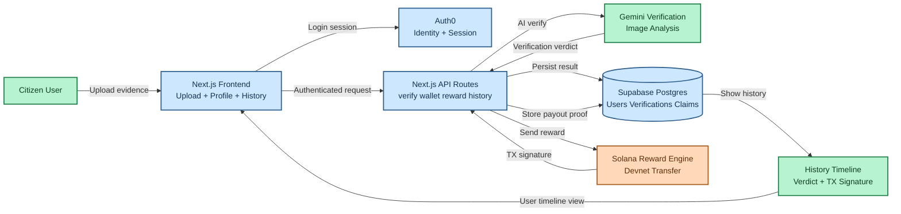

# LitterLoot: Healing the Earth, One Micro-Bounty at a Time (AI + Web3)

*This is a submission for [Weekend Challenge: Earth Day Edition](https://dev.to/challenges/weekend-2026-04-16)*

<!-- COVER IMAGE (1000x420) -->
<!-- Replace with your final DEV cover image URL -->

## What I Built

### The problem nobody says out loud

Walk down almost any street, in almost any city, in almost any country, and you will see the same quiet collapse:
plastic bottles crushed into the curb,
food wrappers stuck to wet pavement,
cigarette boxes drifting into drains,
bags tangled in trees like synthetic fruit.

Everyone sees it.
Almost nobody stops.

That is our environmental paradox.
We publicly celebrate Earth Day, post green slogans, and run awareness campaigns,
but privately normalize daily ecological neglect.

The system is not designed for action.
It is designed for awareness.
And awareness alone does not pick up trash.

For years we have asked people to care harder.
Care is not the issue.
Feedback is.

The reward loop is broken:

- Polluting is cheap and immediate.
- Cleaning is costly and invisible.

If you litter, the negative impact is delayed and distributed.
If you clean, the positive impact is immediate but socially and economically unrewarded.
No market signal.
No social signal.
No compounding behavior loop.

So behavior defaults to convenience.
Not because people are monsters.
Because incentives are misaligned.

That is the uncomfortable hypothesis behind LitterLoot:
what if environmental action fails at scale not because morality is weak,
but because the system punishes effort and rewards apathy?

What if we stopped asking for permanent altruism,
and started engineering repeatable incentives for public good?

That is why I built LitterLoot.

Not as another eco dashboard.
Not as another guilt-driven campaign.
As an incentive engine.

### LitterLoot in one sentence

LitterLoot is an AI-powered clean-to-earn app where users submit before/after cleanup proof,
Gemini verifies the impact, and verified actions get rewarded on Solana Devnet.

### Why this framing matters

LitterLoot is based on one core belief:
if extraction has an economy, restoration must have one too.

We already built systems that reward consumption in real time.
We already know how to design loops that humans repeat.

So the real question is not whether people can be convinced to care.
It is whether we can design a civic incentive loop where doing the right thing is easy to repeat,
visible to verify, and meaningful to sustain.

LitterLoot turns cleanup from invisible volunteer effort into measurable local action.

Capture proof.
Run verification.
Trigger reward.
Store history.
Repeat.

That sequence is the product.
But it is also a thesis:
we can make environmental repair operational, not aspirational.

### Core user flow

1. User logs in.
2. User links a wallet securely.
3. User uploads before and after photos.
4. Gemini audits visual evidence.
5. If verified, backend sends micro-reward on Solana.
6. Result and tx signature are stored in history.

This turns cleanup from a moral burden into a repeatable incentive loop.

## Demo

- Live App: https://litter-loot.vercel.app/
- Repository: https://github.com/Sherman95/LitterLoot
- Video Demo: <ADD_YOUR_DEMO_LINK>

<!-- DEMO GIF / VIDEO THUMBNAIL -->

This clip summarizes the full clean-to-earn loop in seconds: authenticate, submit evidence, verify with AI, reward onchain, and persist history.

<!-- APP HERO SCREENSHOT -->

This is the operational entry point of the app. From here, users can access cleanup submission, confirm wallet status, and track participation without switching tools.

<!-- BEFORE / AFTER PROOF -->

This image pair is the primary evidence input for verification. The product depends on clear visual contrast between the polluted state and the restored state.

<!-- VERIFICATION RESULT SCREENSHOT -->

This screen shows the AI decision layer in action. It returns a structured verdict and reasoning, which directly gates whether a reward can be issued.

<!-- REWARD TX / SOLSCAN PROOF -->

After a successful verification, the backend executes a Solana Devnet transfer. This proof confirms the reward is not simulated but auditable through transaction data.

<!-- IOS PHANTOM SECURE FLOW -->

This captures the hardened iOS flow for wallet linking. A one-time challenge and controlled deep-link handoff solve session-loop issues while preserving signature-based ownership proof.

Suggested 45-second demo sequence:

1. Sign in with Auth0.
2. Link wallet from profile.
3. Upload before/after proof.
4. Trigger verification.
5. Show verdict, reward tx, and history update.

## Code

Main implementation areas:

- Frontend pages and routes: app/
- Wallet UX and profile flow: components/profile/
- Verification API: app/api/verify/route.ts
- Wallet APIs: app/api/wallet/
- Secure mobile wallet-link APIs: app/api/wallet/mobile/
- Persistence layer: utils/userWalletStore.ts
- Solana reward sender: utils/solanaReward.ts
- Supabase schema: supabase/001_init_litterloot.sql

### End-to-End Architecture

End-to-end architecture: authenticated evidence submission, AI decisioning, persistence, and onchain micro-bounty payout.

Color legend:

- Green: environmental impact journey
- Blue: platform infrastructure and trust boundaries
- Orange: blockchain payout domain

<!-- DATABASE SCHEMA / TABLE PROOF (OPTIONAL) -->

## How I Built It

### Stack

Layer | Technology
---|---
Framework | Next.js 14 (App Router)
Language | TypeScript
Auth | Auth0 (`@auth0/nextjs-auth0`)
AI | Google Gemini (`@google/generative-ai`)
Blockchain | Solana Devnet (`@solana/web3.js`)
Storage | Supabase Postgres (with local SQLite fallback)
UI | Tailwind CSS + React components
Deployment | Vercel

### 1) Product architecture

I split the app into four trust boundaries:

1. Identity (Auth0)
2. Wallet ownership proof (challenge + signature)
3. Verification intelligence (Gemini)
4. Reward execution and persistence (Solana + Postgres)

This mattered because every incentive app has one core risk: fraud.
Weak boundaries become payout exploits.

### 2) Identity and access control (Auth0)

Reward systems attract bots and abuse.
Without identity controls, one actor can create fake accounts and drain rewards.

Implemented:

- Session-based protected routes via middleware
- Authenticated API access checks
- Strict separation of public vs protected actions

This ensures the reward path is always tied to an authenticated principal.

### 3) Wallet linking and signature validation

Users cannot claim rewards by typing any wallet string.
They must prove wallet ownership cryptographically.

Standard flow:

1. Backend generates challenge with expiration.
2. User signs challenge from wallet.
3. Backend verifies ed25519 signature.
4. Wallet is linked to user account.

This prevents reward hijacking and accidental misbinding.

### 4) Mobile iOS hard case (Safari <-> Phantom)

The hardest bug was iOS context switching.
If login starts in Safari and wallet opens in Phantom app context,
session continuity can break and loop the user back to login.

I implemented a secure mobile wallet-link flow:

- Create one-time wallet link attempt ticket (`wallet_link_attempts`)
- Ticket has TTL and single-use consumption
- Open dedicated `/wallet-link?attempt=...` flow in Phantom context
- Sign there and complete server-side link
- Mark attempt as used to prevent replay

This removed the fragile legacy loop and made iOS linking practical.

### 5) Gemini as strict cleanup auditor

The verifier must be strict, deterministic, and parseable.
I used Gemini with a constrained JSON contract:

- `verified: boolean`
- `reasoning: string`

Guardrails implemented:

- MIME whitelist (jpg/png/webp)
- Max image size check
- Timeout wrapper for model calls
- Quota and retry response handling
- Schema parse checks for model output

If verification fails, no payout.
If verification passes, reward dispatch begins.

### 6) Solana reward engine

Micro-rewards only work with low latency and near-zero fees.
Solana Devnet was ideal for this prototype.

Reward pipeline:

1. Validate linked wallet exists.
2. Normalize wallet input defensively.
3. Build transfer transaction.
4. Submit and confirm tx.
5. Persist tx signature in verification history.

I also hardened wallet parsing to avoid cryptic invalid-address failures.

### 7) Persistence in Supabase/Postgres

Production persistence runs on Postgres with Supabase schema.

Tables used:

- `wallet_links`
- `wallet_challenges`
- `wallet_link_attempts`
- `verification_history`
- `achievement_claims`

This supports reward auditability, claim safety, and durable session-independent wallet-link attempts.

### 8) Reliability hardening

Hardening done during iteration:

- Verification rate limit window by user
- Claim race-condition protections
- Better reward wallet normalization and validation
- Build/runtime config guards for cloud DB connectivity
- Clearer user-facing failure reasons

Goal: not just demo success, but safer failure behavior under real usage.

## Prize Categories

Submitting to:

- Best use of Google Gemini
- Best use of Auth0 for Agents
- Best use of Solana
- Best use of GitHub Copilot

### Best use of Google Gemini

Gemini is the decision engine for visual cleanup verification,
configured with strict output constraints for automation and anti-fraud consistency.

### Best use of Auth0 for Agents

Auth0 secures identity before any reward-bearing action,
reducing abuse vectors in a tokenized incentive app.

### Best use of Solana

Solana enables fast and low-cost micro-transfers,
which is essential for maintaining motivation in clean-to-earn mechanics.

### Best use of GitHub Copilot

Copilot accelerated hardening cycles:
API safeguards, iOS wallet-link flow refactors, runtime debugging, and deployment iteration.

## What I Would Add Next

1. Anti-spoof image checks (metadata + similarity heuristics)
2. Geofenced community cleanup missions
3. Sponsored bounty pools for campuses and neighborhoods
4. Brand-level litter attribution for EPR-style accountability
5. Public impact dashboard with verified cleanup heatmaps

## Final Reflection

The Earth does not need more slogans.
It needs systems that make repair repeatable.

LitterLoot is my attempt to build one such system.

Not with guilt.
Not with performative awareness.
With verification, incentives, and feedback loops that close.

If we can engineer systems that reward extraction,
we can engineer systems that reward restoration.

That is the thesis.
This is the first implementation.
